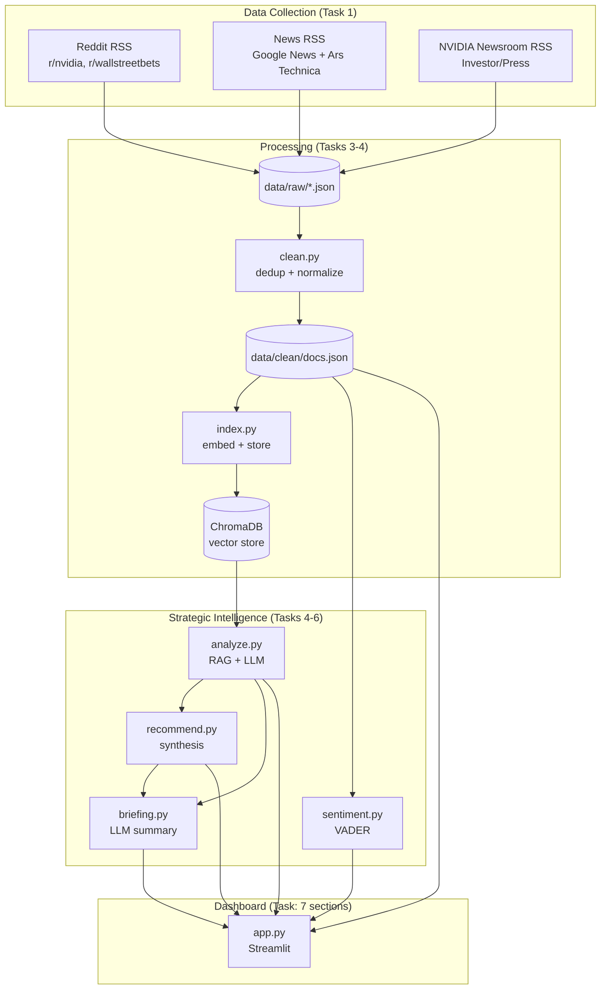
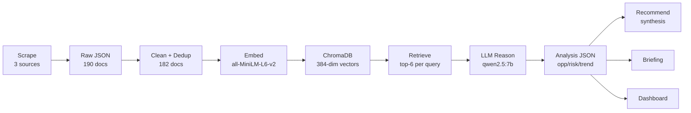

# NVIDIA Strategic Intelligence Agent (AI CEO Agent)

An AI-powered strategic intelligence system that collects live information about
NVIDIA from multiple independent public sources, reasons over it using a local
open-source LLM, and generates evidence-based executive recommendations.


**"If you were NVIDIA's CEO today, what would you do next and why?"**

---

## 1. System Architecture



---

## 2. Data Flow



**The pipeline is run-once and deterministic.** Each stage writes JSON to disk;
the dashboard only reads those files, so it never calls the LLM at render time.

---

## 3. Technology Stack

| Layer | Choice | Notes |
|---|---|---|
| Language / runtime | Python 3.13 | venv on Apple Silicon (M4) |
| LLM serving | Ollama | local, no API keys |
| Reasoning LLM | `qwen2.5:7b-instruct` | open-source, strong at JSON output |
| Embedding model | `all-MiniLM-L6-v2` | 384-dim, fast, sufficient for short docs |
| Vector store | ChromaDB | persistent, cosine similarity |
| Sentiment | VADER | lexicon-based, fast, deterministic |
| Dashboard | Streamlit | 7-section executive dashboard |
| Collection | feedparser + requests | RSS feeds |

**Data sources (3 independent viewpoints):**
- **Community** — Reddit (r/nvidia, r/wallstreetbets) via RSS
- **Press** — Google News (NVIDIA query) + Ars Technica via RSS
- **Corporate** — NVIDIA Newsroom (official press releases) via RSS

182 cleaned documents from 3 independent sources.

---

## 4. AI Pipeline

1. **Collect** — three scrapers pull RSS feeds, each emitting an identical
   8-field schema (`id, source, source_detail, title, text, url, date, scraped_at`).
   Provenance (`url`, `date`) is captured at collection so every later finding
   can cite its source.
2. **Clean** — HTML entities stripped, boilerplate removed, **within-source**
   duplicates dropped (cross-source duplicates are kept as corroborating evidence).
3. **Index** — each document is embedded (title + text) into a 384-dim vector
   with all-MiniLM-L6-v2 and stored in ChromaDB with full metadata. One document
   = one vector (no chunking).
4. **Analyze (RAG)** — for each category (opportunities / risks / trends), the
   system embeds a category query, retrieves the top-6 nearest documents, and
   passes them to the LLM, which returns strict JSON findings citing the
   document IDs that support each one.
5. **Recommend** — a single LLM call synthesizes findings *across* all three
   categories into prioritized recommendations, each with priority, expected
   impact, a financial/operational/strategic risk assessment, and multi-source
   evidence.
6. **Sentiment** — VADER scores every document, aggregated by source and into a
   daily trend.
7. **Briefing** — one LLM call produces the three-part CEO summary
   (what happened / why it matters / what next).
8. **Dashboard** — Streamlit reads all cached JSON and renders the 7 sections.

---

## 5. Design Decisions

> These are the deliberate engineering tradeoffs made under a 1-week deadline,
> optimizing for a reliable, defensible system over maximum sophistication.

- **RSS instead of Reddit/news JSON APIs.** Reddit's JSON endpoint returns 403
  without OAuth; RSS is publicly accessible and needs no auth keys. RSS gives
  less per item but is reliable and fast to reach 100+ documents.

- **ChromaDB instead of FAISS.** ChromaDB persists to disk automatically and
  manages embedding-to-ID mapping; FAISS requires handling persistence and ID
  mapping manually. For a first vector-store project under deadline, ChromaDB is
  lower-risk. FAISS's speed advantage is irrelevant at 182 documents.

- **all-MiniLM-L6-v2 instead of bge-base.** Smaller (384-dim, ~80MB) and faster.
  For short documents the retrieval-quality gap versus bge-base is negligible,
  and MiniLM embeds the whole corpus in ~2 seconds.

- **No chunking.** Documents are already short (headlines, posts, press-release
  summaries), so one document = one chunk = one vector. Chunking would add
  complexity with no benefit and keeps each retrieval result mapping cleanly to
  one source URL for evidence.

- **Separate LLM calls per category (analysis).** Each category gets its own
  focused retrieval, so the evidence is tailored; a single combined call would
  blur the evidence and a single JSON failure would lose all three categories.

- **One LLM call for recommendations.** Recommendations synthesize *across*
  categories (e.g. addressing a risk by leveraging an opportunity), so the model
  must see all findings at once — the opposite of the analysis step.

- **VADER instead of LLM-based sentiment.** §5 needs positive/negative/neutral
  buckets and a trend; VADER scores 182 docs deterministically in under a second.
  Sentiment is reported per-source because VADER reads expressive Reddit text
  well but news headlines are neutral by design.

- **Deterministic pipeline, not an autonomous agent.** The control flow is fixed
  and run-once; the *reasoning* (analyze / prioritize / recommend / justify) is
  dynamic and LLM-driven. Determinism was chosen for debuggability and a stable
  live demonstration. A production version would add an autonomous control loop.

- **Dashboard reads cached JSON, never calls the LLM live.** All expensive work
  runs beforehand and writes JSON; the dashboard only displays it, so it renders
  instantly and cannot hang or crash mid-demo on an LLM timeout.

- **Evidence binding with validation.** The LLM may only cite document IDs that
  were in the retrieved set; every returned ID is validated against that set, and
  unmatched IDs are flagged rather than silently shown — guarding against
  hallucinated evidence.

---

## 6. Limitations & Tradeoffs

Honest constraints, kept visible rather than hidden:

- **Google News documents are headline-only.** The RSS feed provides titles, not
  full article bodies. Headlines carry the strategic signal (e.g. "Amazon to
  Undercut Nvidia"), but full-text fetching is a deferred enhancement. NVIDIA IR
  and Reddit documents do carry full text.
- **Briefing and risk-assessment depth are bounded by the 7B model.** The
  structure is correct (three questions answered, three risk dimensions present);
  the prose is competent but not deeply insightful, which is the ceiling of an
  open-source 8B-class model summarizing pre-summarized input.
- **Run-once, not continuous.** The pipeline is executed manually rather than
  running as a persistent monitoring agent.

---

## 7. How to Run

```bash
# 0. Prerequisites: Ollama running with the model pulled
ollama serve
ollama pull qwen2.5:7b-instruct

# 1. Environment
python3 -m venv .venv && source .venv/bin/activate
pip install -r requirements.txt

# 2. Collect (writes data/raw/*.json)
python scrapers/reddit_scraper.py
python scrapers/news_scraper.py
python scrapers/nvidia_ir_scraper.py

# 3. Clean + index
python clean.py
python index.py

# 4. Generate intelligence
python analyze.py
python recommend.py
python sentiment.py
python briefing.py

# 5. Launch dashboard
streamlit run app.py
```

---

## Project Structure

```
nvidia_ceo_agent/
├── scrapers/
│   ├── reddit_scraper.py
│   ├── news_scraper.py
│   └── nvidia_ir_scraper.py
├── clean.py
├── index.py
├── analyze.py
├── recommend.py
├── sentiment.py
├── briefing.py
├── app.py
├── requirements.txt
├── data/
│   ├── raw/          # scraped JSON, one file per source
│   ├── clean/        # cleaned + deduplicated docs
│   ├── analysis.json
│   ├── recommendations.json
│   ├── sentiment.json
│   └── briefing.json
├── chroma_db/        # persistent vector store (regenerable)
└── README.md
```
