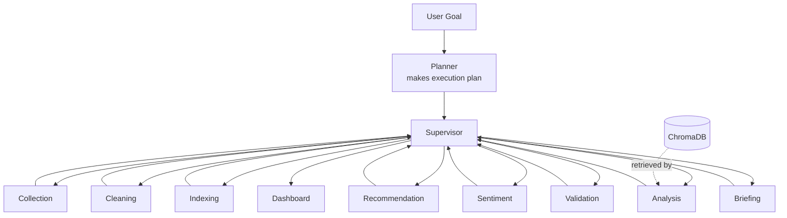
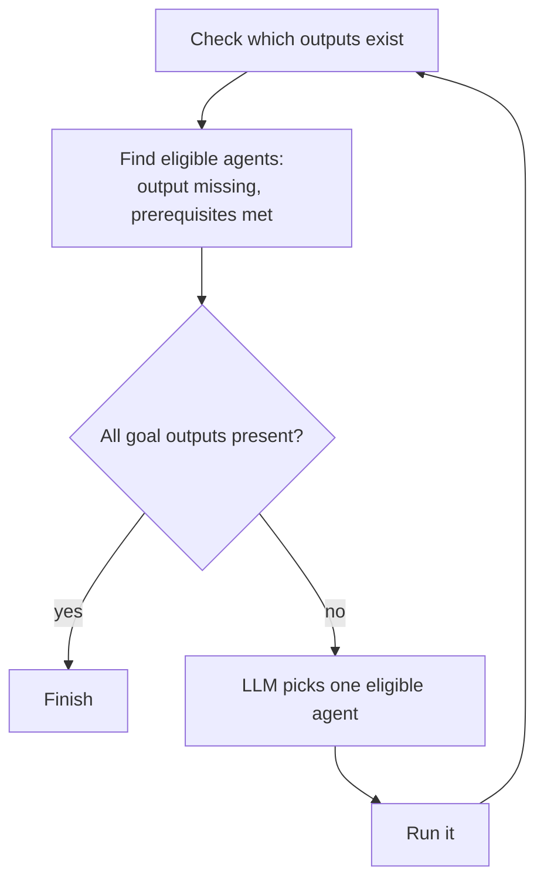
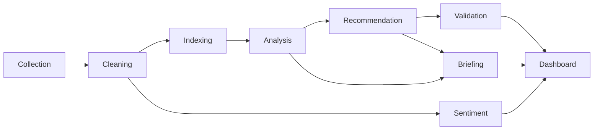

# NVIDIA AI CEO Agent

A multi-agent system that collects live information about NVIDIA, analyzes it, and
produces validated, evidence-based recommendations for an executive reader. It is
built with LangGraph: a supervisor agent receives the goal and routes work to eight
specialized agents, deciding which one runs next based on what data exists and what
the goal still needs. The system is meant to answer a CEO-level question: given
what's happening right now, what should NVIDIA do next, and what's the evidence.

## Architecture

The system is a LangGraph graph. A supervisor sits in the middle and decides, at each
step, which agent to run. Each agent wraps an engine that does the actual work
(scraping, embedding, analysis, and so on). LangGraph handles the routing and the
shared state that the agents pass between each other.



Not every component is equally "agentic", and the table below is honest about that.
Some components reason and make their own decisions; some call the LLM once to
synthesize text; some are plain deterministic steps with no LLM at all.

| Component | Type | Engine | What it does |
|---|---|---|---|
| Planner | reasoning agent | LLM | Runs once at the start; turns the goal into an ordered execution plan. |
| Supervisor | reasoning agent | LLM router | Picks the next agent to run from those eligible, and decides when the goal is met. |
| Collection | deterministic node | `scrapers/*` | Scrapes Reddit, news, and NVIDIA IR over RSS. |
| Cleaning | deterministic node | `clean.py` | Removes duplicates and normalizes the raw documents. |
| Indexing | deterministic node | `index.py` | Embeds the documents and stores them in ChromaDB. |
| Analysis | reasoning agent | `agent.py` | Retrieves evidence, generates findings, judges whether the evidence is enough, and retrieves more if it isn't. |
| Recommendation | reasoning node | `recommend.py` | One LLM call that turns the findings into prioritized recommendations. |
| Sentiment | deterministic node | `sentiment.py` | VADER sentiment per source. No LLM. |
| Validation | reasoning agent | `validate.py` | A rule check plus an LLM that judges whether the evidence actually supports each recommendation. Can reject one. |
| Briefing | reasoning node | `briefing.py` | One LLM call that writes the CEO summary. |

The distinction matters for the design. The analysis, validation, and supervisor
components have their own control flow: they loop, judge their own output, or decide
what runs next. Recommendation and briefing use the LLM but only in a single pass, so
they're closer to nodes than agents. Sentiment, cleaning, indexing, and collection
don't use the LLM at all. I labeled each one for what it actually does rather than
calling everything an agent.

## How the goal is planned, then executed

The run has two stages: plan, then execute. A planner node runs once at the
start. It takes the goal and produces an explicit execution plan — the ordered
list of capabilities needed to reach it (collection, cleaning, indexing,
analysis, recommendation, validation, briefing). The plan is stored in the
shared state. The supervisor then executes that plan, routing one agent at a
time.

The planner's order is shaped by data dependencies (you can't analyze before
indexing), so the plan mostly follows the necessary sequence. What the planning
stage adds is that the system reasons about what the goal requires and states it
up front, rather than discovering it step by step. This is the explicit "Plan"
stage in the Goal → Plan → Retrieve → Analyze → Decide → Recommend → Validate
workflow.

## How the supervisor decides

The supervisor executes the plan but does not blindly follow a fixed sequence.
On each turn it looks at which
output files already exist, works out which agents are eligible (their output is
missing and their prerequisites are present), and picks one. The order is still
shaped by real dependencies — you can't index before cleaning, or analyze before
indexing — but the choice of which eligible agent to run, and the decision that the
goal is finished, are the supervisor's. A small deterministic check stops it from
declaring "finished" while a required output is still missing.



## Two kinds of memory

The system keeps external knowledge separate from the agents' own working memory,
which is a distinction students often blur.

ChromaDB is the knowledge base. It holds the scraped documents as vectors, and the
analysis agent retrieves from it. It's external information the agents consult.

The workflow memory is different. LangGraph's shared state carries the lightweight
coordination data — which agents have finished, what the supervisor decided and why,
the running log. The heavier outputs (findings, recommendations, and so on) are
written to JSON files on disk, and the next agent reads them instead of recomputing.
I used files for this deliberately: they survive a crash, I can open and inspect any
intermediate result, and the dashboard reads the same files.

So ChromaDB is a tool the analysis agent uses; it isn't the centre of the system.

## Data flow



Documents are collected broadly and filtered at retrieval time by semantic search, so
relevance is handled where it matters rather than at collection. The dashboard reads
the cached JSON and never calls the LLM, so it loads instantly and can't stall during
a demo.

## Technology

| Layer | Choice | Why |
|---|---|---|
| Agent framework | LangGraph | Supervisor plus agent nodes, shared state, conditional routing. |
| LLM integration | LangChain (`langchain-ollama`) | `ChatOllama` wrapper around the local model. |
| Reasoning model | `qwen2.5:7b-instruct` via Ollama | Local, open-source, no API keys. Good at structured JSON. |
| Embeddings | `all-MiniLM-L6-v2` | 384-dim, fast, fine for short documents. |
| Knowledge base | ChromaDB | Persists automatically, handles ID mapping, cosine similarity. |
| Sentiment | VADER | Lexicon-based, deterministic, fast. |
| Dashboard | Streamlit | Seven-section executive view. |
| Collection | feedparser + requests | RSS feeds. |

Three independent sources are used: Reddit (community), Google News and Ars Technica
(press), and the NVIDIA newsroom (corporate). After cleaning there are usually around
180 to 190 documents; the exact number changes on each run because the data is live.

## Design decisions

A few choices worth explaining:

LangGraph supervisor instead of a fixed script. Eight agents with a supervisor that
routes between them, rather than a hardcoded pipeline. This is the main thing that
makes it a multi-agent system rather than a sequence of function calls.

Components labeled for what they do. The analysis and validation agents have real
control flow; recommendation and briefing are single LLM calls; sentiment and the
data-prep steps are deterministic. Calling the VADER step an "agent" would be
misleading, so I don't.

Knowledge and memory kept separate. ChromaDB for external knowledge, LangGraph state
plus JSON files for the agents' working memory.

Self-evaluating analysis. The analysis agent checks whether its own evidence is
strong enough and retrieves more if not. If it still can't reach a confident result
within its limit, it marks the findings as provisional, and the dashboard shows that
rather than presenting them as certain.

Validation before anything is shown. Recommendations go through a rule check and an
LLM groundedness check. If one fails, the dashboard shows it as not validated, with
the reason, instead of hiding it.

Some smaller ones: RSS instead of the Reddit JSON API, which returns 403 without
OAuth. ChromaDB over FAISS for the automatic persistence; the speed difference doesn't
matter at this size. MiniLM with no chunking, because the documents are short, so one
document maps to one vector and one piece of evidence. Sentiment reported per source,
because Reddit is expressive and news headlines are written more neutrally.

## Limitations

The supervisor's routing is constrained by dependencies. The order is mostly fixed by
what data has to exist first. The genuine choices it makes are which eligible agent to
run and when to stop. That's accurate rather than something to hide.

The LLM router can make a bad call. A deterministic check overrides a premature
"finish" or an invalid pick.

Risk coverage depends on the data. If a run's documents don't contain many real risks,
the analysis agent reports fewer and flags low confidence instead of inventing them.

The model is a 7B open-source model. The prose is decent but bounded by model size;
the structure and the grounding come from the pipeline, not the model.

Live scraping can be rate-limited, mostly by Reddit. The collection step backs off and
keeps going if one source fails. For a demo it's safer to scrape once and then work off
the cached data.

## Running it

```bash
# Ollama must be running with the model pulled
ollama serve
ollama pull qwen2.5:7b-instruct

python3 -m venv .venv && source .venv/bin/activate
pip install -r requirements.txt

# Run the multi-agent system
python graph_agents.py            # uses existing data if present
python graph_agents.py --scrape   # full run from a fresh scrape

streamlit run app.py
```

There's also a simpler orchestrator, `agent_orchestrator.py`, that runs the same
engines without LangGraph. I kept it as a fallback.

## Files

```
nvidia_ceo_agent/
├── graph_agents.py         # LangGraph multi-agent system (supervisor + 8 agents)
├── agent_orchestrator.py   # simpler orchestrator, kept as a fallback
├── agent.py                # analysis agent (self-evaluating retrieval loop)
├── validate.py             # validation agent
├── scrapers/               # Reddit, news, NVIDIA IR
├── clean.py                # cleaning
├── index.py                # embedding + ChromaDB
├── analyze.py              # the RAG engine agent.py drives
├── recommend.py            # recommendation
├── sentiment.py            # VADER sentiment
├── briefing.py             # CEO briefing
├── app.py                  # Streamlit dashboard
├── requirements.txt
├── data/                   # raw, cleaned, and output JSON
├── chroma_db/              # vector store
└── README.md
```