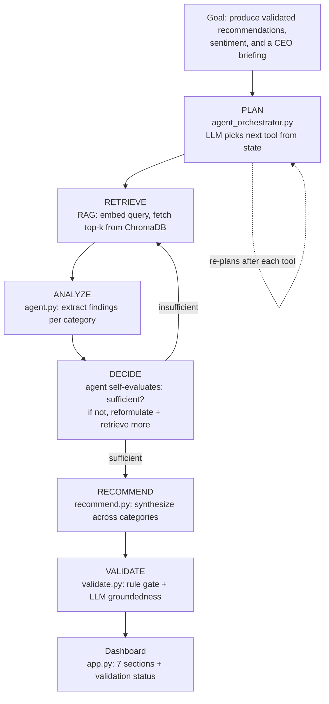
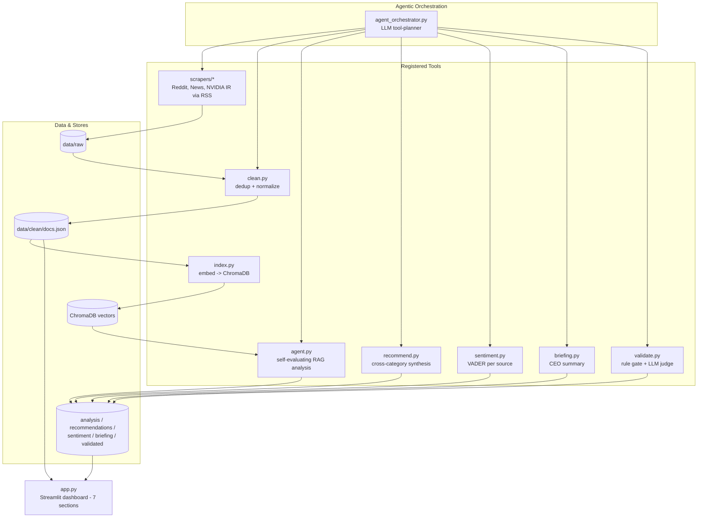
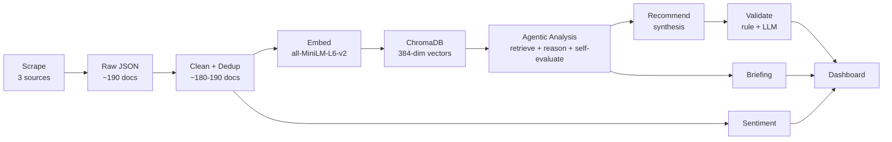

# NVIDIA AI CEO Agent — Strategic Intelligence System

An **agentic** strategic-intelligence system that autonomously collects live
information about NVIDIA, reasons over it, and produces **validated**,
evidence-based executive recommendations.

The system is built around an explicit agent workflow:

```
Goal → Plan → Retrieve → Analyze → Decide → Recommend → Validate
```

It does not merely send a prompt to an LLM. A planning agent decides which
tool to run next, a self-evaluating analysis agent decides whether it has
gathered enough evidence, and a validation agent checks every recommendation
before it is presented. It answers the question:
**"If you were NVIDIA's CEO today, what would you do next — and why?"**

---

## 1. Agent Capabilities (how the system goes beyond prompt → LLM)

| Capability | Where it lives | What it does |
|---|---|---|
| **Planning before execution** | `agent_orchestrator.py` | An LLM planner is given the registered tools + current state and decides the next tool to run, respecting data dependencies. |
| **Autonomous decision-making** | `agent_orchestrator.py`, `agent.py` | The orchestrator chooses each next step; the analysis agent decides whether evidence is *sufficient* or whether to retrieve more. |
| **Tool usage beyond the LLM** | scrapers, `index.py`, ChromaDB, VADER | The system uses non-LLM tools: RSS scrapers, an embedding model, a vector database, and a lexicon sentiment analyzer. |
| **Retrieval & use of evidence** | `analyze.py` (RAG) | Documents are retrieved by semantic similarity and bound to findings by ID; only retrieved evidence may be cited. |
| **Risk / opportunity / trend analysis** | `agent.py` / `analyze.py` | Three category agents extract findings, each grounded in cited evidence. |
| **Validation before presenting** | `validate.py` | A rule-based gate + an LLM groundedness judge check every recommendation; failures are flagged on the dashboard. |
| **Memory** | `agent.py`, `agent_orchestrator.py` | The analysis agent remembers tried queries and seen docs across iterations; the orchestrator tracks completed artifacts. |

---

## 2. The Agent Workflow



**Planning loop (orchestrator).** `agent_orchestrator.py` registers each
operation as a *tool* (name, description, prerequisites, output). At every step
it builds the current state — which artifacts exist, which tools are eligible —
and asks the LLM planner which tool to run next. It runs that tool, re-plans,
and repeats until the goal is met. A deterministic guard prevents the planner
from declaring completion while a required output is still missing.

**Decision loop (analysis agent).** `agent.py` wraps the RAG analysis with a
self-evaluation loop: after producing findings it asks the LLM whether the
evidence is sufficient. If not, it reformulates the query, increases the number
of retrieved documents, and tries again (up to a cap), remembering what it has
already tried. If it never reaches sufficiency, it flags the findings as
*provisional / low confidence* — surfaced honestly on the dashboard rather than
presented as certain.

**Validation (validation agent).** `validate.py` checks each recommendation in
two layers: a deterministic structural gate (valid priority, present evidence,
complete risk assessment) and an LLM groundedness judge (does the cited evidence
actually support the claim?). Recommendations that fail are flagged on the
dashboard with the reason.

---

## 3. System Architecture



---

## 4. Data Flow



The system collects broadly and filters at *retrieval* (semantic search),
not at collection — so relevance is enforced where it matters. The dashboard
reads only cached JSON and never calls the LLM live, so it renders instantly
and cannot stall during a demo.

---

## 5. Technology Stack

| Layer | Choice | Notes |
|---|---|---|
| Language / runtime | Python 3.13 | venv on Apple Silicon (M4) |
| LLM serving | Ollama | local, open-source, no API keys |
| Reasoning LLM | `qwen2.5:7b-instruct` | strong structured-JSON output |
| Embedding model | `all-MiniLM-L6-v2` | 384-dim, fast, sufficient for short docs |
| Vector store | ChromaDB | persistent, cosine similarity |
| Sentiment | VADER | lexicon-based, fast, deterministic |
| Dashboard | Streamlit | 7-section executive dashboard |
| Collection | feedparser + requests | RSS feeds |

**Data sources (3 independent viewpoints):** community (Reddit), press
(Google News + Ars Technica), and corporate (NVIDIA Newsroom) — all via RSS.
~180-190 cleaned documents; the exact count varies with each live collection.

---

## 6. Design Decisions

- **Agentic orchestration over a fixed script.** Each operation is a registered
  tool; an LLM planner sequences them and re-plans after each step, with a
  deterministic guard so it cannot finish while a required output is missing.
  This combines LLM flexibility with deterministic guarantees.

- **Autonomy placed where choice is real.** The pipeline's stage order is
  constrained by data dependencies (you cannot index before cleaning), so the
  meaningful autonomous decision is *inside* analysis — "is the evidence
  sufficient, or do I retrieve more?" That is a genuine choice with alternatives,
  not a forced step.

- **Honest uncertainty.** When the analysis agent cannot reach sufficient
  evidence within its iteration cap, it flags findings as provisional rather than
  presenting them as certain. The dashboard shows this.

- **Validation before presentation.** Recommendations pass a rule gate + an LLM
  groundedness check; failures are shown with their reason rather than hidden.

- **RSS not JSON APIs.** Reddit's JSON endpoint 403s without OAuth; RSS is public
  and needs no keys.

- **ChromaDB over FAISS.** Automatic persistence and ID mapping; FAISS's speed
  advantage is irrelevant at this corpus size (~180-190 docs).

- **all-MiniLM-L6-v2, no chunking.** Documents are short, so one document = one
  vector; chunking would add complexity with no benefit and keeps each retrieval
  result mapping cleanly to one source URL.

- **Separate analysis calls per category, one synthesis call for recommendations.**
  Analysis extracts *within* a category (focused retrieval); recommendations
  synthesize *across* categories, so the model must see all findings at once.

- **VADER per source.** Fast and deterministic; reported per source because
  community text is expressive while news headlines are written more neutrally.

- **Dashboard reads cached JSON, never calls the LLM live** — so it renders
  instantly and cannot hang mid-demo.

---

## 7. Limitations & Tradeoffs

- **LLM planner can err.** The planner is an LLM and can mis-judge completion;
  a deterministic goal-check overrides premature "finish" decisions.
- **Risk coverage depends on the corpus.** If genuine NVIDIA risks are sparse in
  a given collection, the agent reports fewer (and flags low confidence) rather
  than inventing them.
- **Google News documents are headline-only.** RSS provides titles/summaries, not
  full article bodies; NVIDIA IR and Reddit documents carry fuller text.
- **Open-source 7B model.** Briefing/risk prose is competent but bounded by model
  size; structure and grounding are enforced by the pipeline.

---

## 8. How to Run

```bash
# 0. Prerequisites: Ollama running with the model pulled
ollama serve
ollama pull qwen2.5:7b-instruct

# 1. Environment
python3 -m venv .venv && source .venv/bin/activate
pip install -r requirements.txt

# 2. Run the full agent (plans + executes the whole workflow)
#    Add --scrape to force fresh collection (otherwise cached data is reused).
python agent_orchestrator.py

# 3. Launch the dashboard
streamlit run app.py
```

To force a complete fresh run from scratch:

```bash
rm -rf data/raw data/clean chroma_db
rm -f data/analysis.json data/recommendations.json data/sentiment.json \
      data/briefing.json data/recommendations_validated.json
python agent_orchestrator.py --scrape
```

The agent runs each stage as a tool, in dependency order, and finishes only
when all goal artifacts — including the validated recommendations — exist.

---

## 9. Project Structure

```
nvidia_ceo_agent/
├── agent_orchestrator.py   # LLM tool-planner (Plan)
├── agent.py                # self-evaluating analysis agent (Analyze + Decide)
├── validate.py             # validation agent (Validate)
├── scrapers/               # Reddit, News, NVIDIA IR (RSS)
├── clean.py                # dedup + normalize
├── index.py                # embed -> ChromaDB
├── recommend.py            # cross-category synthesis
├── sentiment.py            # VADER per source
├── briefing.py             # CEO summary
├── app.py                  # Streamlit dashboard (7 sections)
├── run_pipeline.py         # simple deterministic runner (baseline)
├── requirements.txt
├── data/
│   ├── raw/                # scraped JSON per source
│   ├── clean/docs.json     # cleaned + deduplicated
│   ├── analysis.json
│   ├── recommendations.json
│   ├── recommendations_validated.json
│   ├── sentiment.json
│   └── briefing.json
├── chroma_db/              # persistent vector store
└── README.md
```